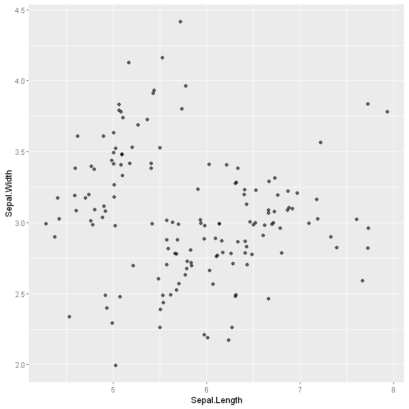
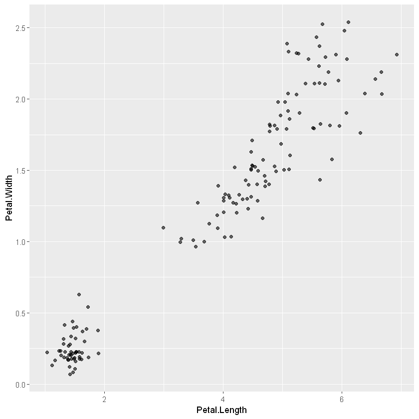
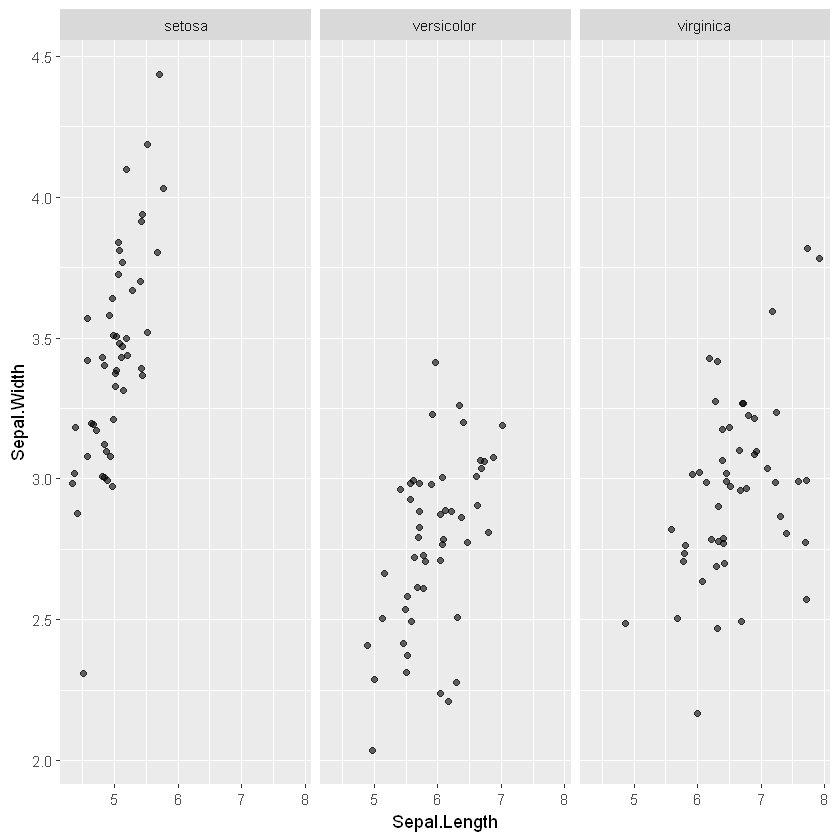
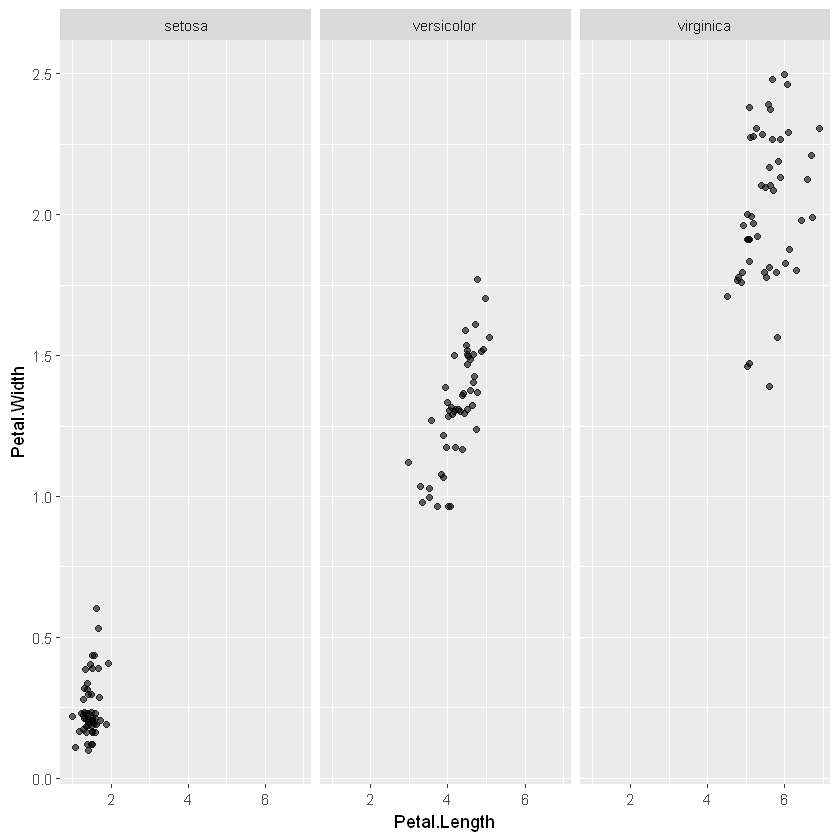

### Installing ggplot2 library

In order to work with ggplot library, we have to install it first beacause R
by default doesn't have the ggplot2 library. Mine is already installed. All you
have to do is run the cell bellow without the comment.


```R
# install.packages("ggplot2")
```

In this tutorial, we will plot the IRIS Dataset in R using ggplot2 library. So
Iris dataset is basically a dataset containing data of three diffent kinds of 
Iris flower.
* Setosa
* Verginica
* Versicolor

In order to plot our data, we have to import the ggplot2 library. Let's do it


```R
library(ggplot2)
```

    Warning message:
    "package 'ggplot2' was built under R version 3.6.3"

Once we have imported the ggplot library, we are welcome to plot our data. In this case, the Iris dataset. Now the question is from where we are gonna have 
our data? Well, the good news is ggplot already has the dataset. Sounds good right? All we have to do is use it. Let's look at the data first.


```R
head(iris)
```


<table>
<thead><tr><th scope=col>Sepal.Length</th><th scope=col>Sepal.Width</th><th scope=col>Petal.Length</th><th scope=col>Petal.Width</th><th scope=col>Species</th></tr></thead>
<tbody>
	<tr><td>5.1   </td><td>3.5   </td><td>1.4   </td><td>0.2   </td><td>setosa</td></tr>
	<tr><td>4.9   </td><td>3.0   </td><td>1.4   </td><td>0.2   </td><td>setosa</td></tr>
	<tr><td>4.7   </td><td>3.2   </td><td>1.3   </td><td>0.2   </td><td>setosa</td></tr>
	<tr><td>4.6   </td><td>3.1   </td><td>1.5   </td><td>0.2   </td><td>setosa</td></tr>
	<tr><td>5.0   </td><td>3.6   </td><td>1.4   </td><td>0.2   </td><td>setosa</td></tr>
	<tr><td>5.4   </td><td>3.9   </td><td>1.7   </td><td>0.4   </td><td>setosa</td></tr>
</tbody>
</table>


So it has four features and three labels. The features are:
* Sepal Length
* Sepal Width
* Petal Length
* Petal Width

And the labels are the names os our iris flowers:
* Iris Setosa
* Iris Verginica
* Iris Versicolor

Now it is time to plot what we have. Here is a problem! As our monitor is capable to show 2D pictures only and we have four features, we have to satisfy ourselves by plotting only two of out features. In our case:
* The Sepal Length
* The Sepal Width

Let's get it done!!!


```R
ggplot(iris, aes(x = Sepal.Length, y = Sepal.Width)) +
geom_jitter(alpha=0.6)
```


    

    


Now let's look at 
* Petal Length
* Petal Width


```R
ggplot(iris, aes(x = Petal.Length, y = Petal.Width)) +
geom_jitter(alpha=0.6)
```


    

    


To be more specific, let's do this: "The Facet Grid"
With Sepal Length and Sepal Width.


```R
ggplot(iris, aes(x = Sepal.Length, y = Sepal.Width)) +
geom_jitter(alpha=0.6) +
facet_grid(. ~ Species)
```


    

    


What it does is separates on the basis of Species. Now let's look at Petals


```R
ggplot(iris, aes(x = Petal.Length, y = Petal.Width)) +
geom_jitter(alpha=0.6) +
facet_grid(. ~ Species)
```


    

    


** That's all for today, hope you liked it. **
